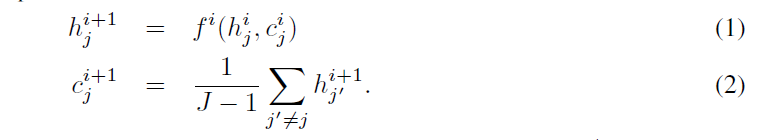
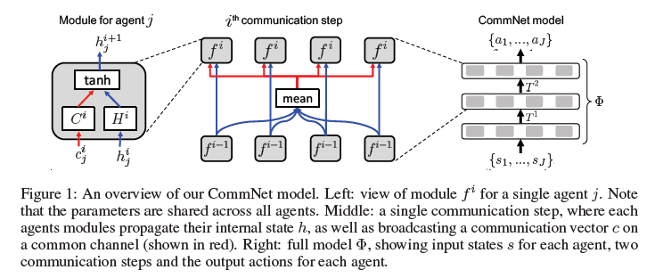
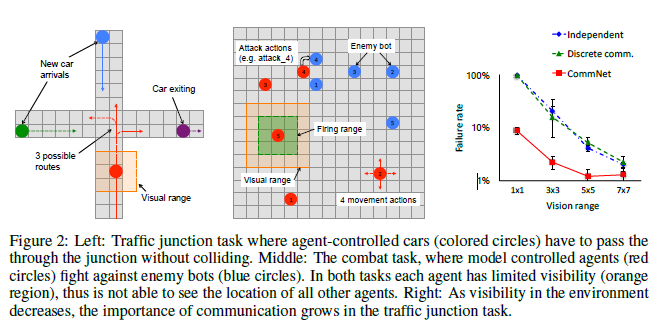
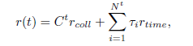
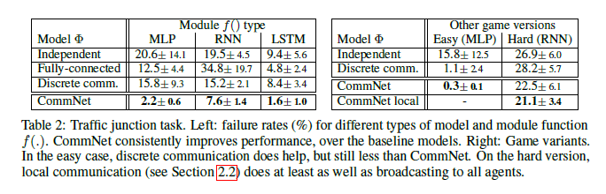
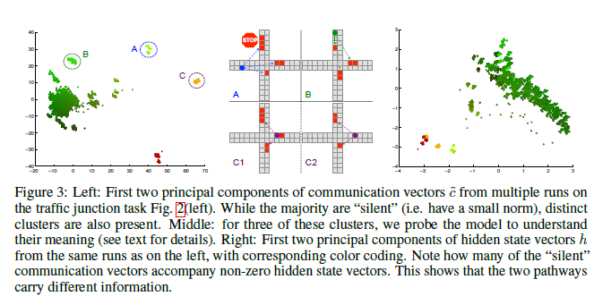

## Abstract

很多任务在Ai中都需要多个智能体之间的交互。特别地，这些相互交互的协议往往是提前手动特化好的，不能随着训练而改变。 
在这篇文章， 提出一个简单的神经模型 CommNet, 用于全合作的任务之间的连续的交流
这个模型包含多个智能体，而且他们之间的交流信息可以依据policy来进行学习得到。
我们应用这个模型到一些列的任务中，使他们自安静相互学习，最终提高他们在非交流智能体和baselines中的表现。
在某些例子中，最好的效果甚至可以根据智能体所产生的语言来做出好的策略
## 1. Introduction
Communication是智能体一个很basic的方面，特别是在真实环境中的复杂任务。但是大多都有着有限的能力limited capabilities或者对环境的不足的可见性visibility。 实际中的例子包括电梯控制，sensor networks, Communication是一个很重要的因素在robot soccer中。在某些特别的环境中，Communication交流甚至比智能体个人Individual的表现更为重要。然而，现有Reinforcement learning中， specification and format of Communication 是 pre-determined.

在这篇work中，我们提出了一种模型，在做出actions之前可以通过agents之间的cooperating来进行学习。Each agent 被一个deep feed-forward network控制, 通过一个continuous vector. 通过这个channel, 他们可以获得来自于其他智能体的summed transmissions。然而，每个agent传递的信息不是a-prioir,而是学习得到的。  因为学习是continuous, 所以模型可以通过back-propagation来进行训练， 所以他们可以与标准的single agent RL algorithms或者supervised learning方法相结合。 这个模型是简单而且多才多艺的，它允许应用于只能partial visibility of the environment, 智能体可以学习task-specific交流通过他们之间的表现。更进一步， 模型可以动态变化， the number and type of agents.

我们考虑设置了J个agents, 所有的一起合作去最大化reward R在某些环境中。 我们做了一个assumption, 每个agent获得R独立于contribution. 这就意味着， each agent有他们各自的控制器或者可以把他们看作a pieces of a larger model一大个训练的模型。
从另一个观点来看，我们的控制器将每个agent的input映射到他们的actions. ? input, 每个agent参加在a subset of units?  
一个特别的在layer之间的结构就是
a. 实例化通信的channe
b. 传播agent的state

我们扩展了这个模型在一系列任务上，在某些方面， supervision 用来提供每一步动作， 偶尔地给别人提供?
In the former case, 对于每个agent多续联的控制器， backpropagation the error signal 通过 connectivity structure，确保智能体学习到如何communication? (学习函数)来最大化目标。
In the latter case, RL会用于一个额外的步骤来提供训练信号，在每个时间步里?  等于说训练数据是通过它提供的?

## 2. Communication Model
我们表述了一个模型用来计算 the distribution over actions $p(\mathbf{a}(t)|\mathbf{s}(t), \theta)$即在给定时间步t下的行动的概率分布。
$s_j$作为$j_{th}$的agents在环境中获取的state. ? == input? yes
controller 's input 是所有的state拼接而成的向量$\mathbf{s}={s_1, s_2, ..., s_J}$,  output是all actions的拼接 $\mathbf{a} = {a_1, a_2, ..., a_J}$
> ?controller每个agent都有一个，然后output是所有的，输出的是直接概率吗？ distribution又是如何得到的

$\Phi$即a single controller 包括individual controllers for each agents, 和communication对于agents.
> ?
### 2.1 Controller Struture
$\Phi$是有modules$f^i$得到的， $i \in \{0,...,K\}$, K是沟通的时间步

每个$f_i$对agent j有两个输入$h_j$和$c_j$
> 注意到的$c_j$这里是收集的不包含自身

$h^{i+1} = \delta(T^i h^i)$
> 这里考虑到了进一步将权重进行简化
> 需要说明的是这里$T^i$具有permutation invariant, 即排列不变性
> 这里$c^{i+1}$允许其他的形式, 所以agent的数量可以发生改变

另外
1. first layer:  encoder funciton, problem dependent问题独立性相关的。 
    > $h^{0} = r(s_j)$, 一般地， $c^0 = 0$
2. end layer: decoder funciton  $a_j = q(h_j^K)$

3. the whole model

    > 解释： $\Phi$是整个过程？, 这个应该不是单个吧？ 灰色阴影是agent, 还是agent group?
    - 用了所有agent的状态? 需要吗？
    - 使用等式1和2
    - 根据decoder, 采样出所有的agents的行动

### 2.2 Model Extensions

1. Local Connectivity: 在$c^i$计算中， 可以选择特别数量的来做
2. Skip Connection: $h^{i+1} = f^i(h^i, c^i, h^0)$, 在f中添加其他T的h的印象
3. Temporal Recurrence: 一直循环某一个$f^i$。
## 3. Related Work

## 4. Experiments

### 4.1 Baselines

1. 独立的控制器： 每个控制器都是独立的一部分，它们之间没有任何交流。 在这里直接认为$\mathbf{a} = (\Phi(s_1), \Phi_(s_2), ..., \Phi_(s_J))$完全是独立的。 这样的优点其实在于分子性和灵活性，可以很好地选择进入或者退出 

2. 全连接的控制器： 认为$\Phi$是一个全连接层的神经网络, softmax使用multiple output softmax heads?.  简单的理解就是所有的agent全进行参与

3. 离散的交流： 一个agents可替代的communicate方式就是通过discrete symbols（感觉就是一些信号量）。 因为$\Phi$包含了离散的操作，所以不可微分，RL可以用来训练。 特别地，一个agent可以在每个communication step产生离散的信号。 但是，如果这里有internal 时间段，我们可以直接应用policy gradient? 如何做， 见下文
$w_j^i ~ softmax(Dh_j^i)$, 这里D是模型的参数。在我们广播的操作中，在下一个$c^{i+1}$的运算即变成了离散的操作之间与，或关系。

### 4.2 Simple Demonstration with a Lever Pulling Task

我们设计一个游戏，需要agent之间相互communicate来win. 这个包括了m个levers(杠杆？ 有什么用？), a pool of N agents. 在each round中， 从N个agents中随机地取m个agents, 他们每个必须选择一个lever to pull(?), 同时与其他m-1个agents进行交互，在每轮结束时(每轮都选？) 
> 每一轮都选m个agent,  每个agent每轮确定一个lever. 每个lever如何初始化？
这个游戏的目标是让它们每个都选择一个不同的lever?, 这是目标？
> lever是什么？
同时，所有的agents按照获取的不同的levers的比列来获得奖励。
每个agent可以看到自己的身份, $s_j = j$
> 所以这是一个间谍游戏，level也是混在其中？？

我们扩展这个游戏m=5, N=500. 使用CommNet拥有两个交流步K=2和skip connections from (4)来进行实验。 
1. encoder是一个N entries of 128D的查找表
2. $f^i$是一个两层的神经网络，以ReLU非线性的结构， $f(h^i, c^i, h^0)$, 输出128D的向量。
3. decoder是一个linear layer plus softmax, 产生关于m layer的一个分布
    > decoder就是$p(a|s, \theta)$, 这里行动action用来选择lever
4. sample来决定使用哪一个

同时与Indepent controller进行对比，所有结构相同，只有c为0.
我们同时扩展了两组实验Supervised和RL
- Supervised: 使用排序agents IDs, 每个agent pull the lever根据当前m agents中的相对顺序
- RL: 另一篇论文

> m=5,  500 trials, 5000 batches of size 64 during traning
> metrics = # distinct / # levers

### 4.3 Multi-turn Games

两项任务：
1. 控制通过交通路口的汽车进入，最大化流量的同时，最大程度减小碰撞
2. 控制多个代理击败敌人

使用前馈神经网络MLP, $f^i$是一个single layer network, K=2 communication steps. 对于RNN module, 我们需要一个$f^i$, 使用共享权重。 最后对$f^t$使用LSTM, 在所有的模块中，hidden layer is 50, MLP使用skip connections. 训练300 epochs, 每一轮进行100 weight updates 使用RMSProp在mini-batch有288论的训练。 
在训练中会经过~8.6M

a few days
#### 4.3.1 Traffic Junction

> left: 观察到车时，可能有的三种行进路线
> middle: 有限的视野， 不能看见己方机器人，目标是攻击对方机器人
> right: 当视野扩大时，实验对比。

包含了4-way junction on 14*14 grid. 在每个时间步里，以某个概率p在四个方向放入车辆，车辆的总共数量为10. 每个car在有限的视野下，选择两种操作，前进或者不动。

当两个车位置重叠时即发生碰撞，此时reward=-10. 不影响以其他方式模拟？

为了缓解交通事故，会给每个时间步安排一个$Tr_{time}$, 于是可以得到总共的时间步:

each car {n, l, r}, 视野范围为3*3, 所以维度为 $3^3 * n * l * r$

将f()使用不同的结构时所带来的失败概率上的问题
#### 4.3.2 Analysis of Communication
Communication的分析

> left: 在traffic junctiontask中，两个主要的成分的交流向量c在多轮运行中的结果。

#### 4.3.3 Combat Task
对抗任务，15*15， m=5 agents, 5*5 初始化位置

视野3*3, 电脑方可以共享位置。

攻击一下就减1，总共生命值3， 只要在视野内即可攻击。

失败条件： 所有agents生命值为0， 达到最终轮数

？

### 4.4 bAbI Tasks
读一段故事回答问题。

## 5. Discussion and Future Work

MARL在多种任务中表现超过没有交流， 全连接，模型利用离散交流信息的模型，我们去的了很好的效果。

另一方面，可扩展的
1. 异构agent types
2. large numbers of agents.