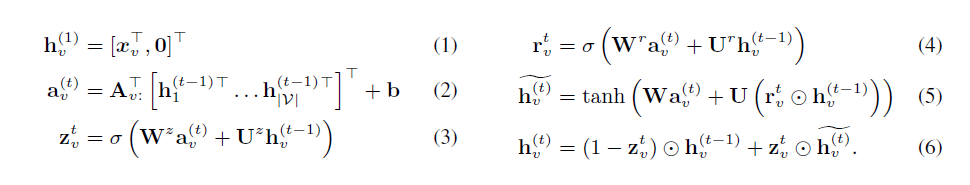
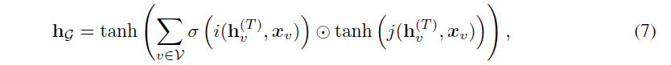

## 摘要
图结构广泛出现在化学、自然语言语义、社交网络和知识结构中。
在这篇工作中，我们学习了关于图结构输入的特征学习方法。
我们开始的起点是2009年的GNN的工作，我们使用gated recurrent units和现代化优化手段，并且扩展到输出序列。
结果是灵活的并且广泛对于神经网络，结果相对于纯粹基于序列的模型具有很好的归纳偏差?，尤其是图结构的模型。(LSTM)
> https://zhuanlan.zhihu.com/p/38740843, 归纳偏差简单的理解就是模型的偏好是什么？
我们描述了模型在bAbI任务上的能力和图的算法学习任务。接下来，我们展示了程序验证中的问题的应用效果，其中子图可以抽象为数据结构

## 1. Introduction
很多现实的图结构任务。 我们想在学习任务中将图作为输入。标准的方法对于问题来说包括对于一个输入图的工程自定义特征， graph kernel.
方法用来定义图的特征通过在图上random walks， 更多的靠近我们目标的是先从图中进行学习特征中能包括GNN, spectral networks以及在图足迹分类，化学分子表示上的方法

我们的主要贡献在于关于GNN在输出sequences上的边线。之前在特征学习的工作主要集中在产生图的单个，但是很多关于图的许多问题需要输出熟悉怒。
例子包括在图上的路径，具有理想节点的枚举，以及图分类任务的序列。比如， a start and end node.
我们不确定现有的工作是否能够很好的解决这个问题
我们的动机来自于程序验证，需要输出logical formulas， 我们把它形式化为一个序列化输出问题。
第二个贡献是GNN是一个广阔的神经网络模型可以应用再现阶段的很多领域

这里有两种关于图的特征学习的设定：
1. 学习关于输入图的表示
2. 学习在产生序列输出的interal state的表示

其中，1主要在GNN的工作里面。我们对这个框架做了调整，比如使用modern practices 有关Recurrent Neural Networks. 2是我们期望从图结构问题中输出的，这不仅仅是individual classfication. 因此，这要的挑战就在于如何在图中学习特征，并且encode 已经产生的partial输出序列（比如path so far if outputting a path），以及还需要被产生的（the remaining path）。 
我们同时也展示了GNN framework can be adapted to these settings, 从而获得一个新的关于基于图的神经网络模型，GGS-NNs

我们阐述了这个模型在bAbI tasks和图算法，在学习模型的能力上。 然后我们展示关于程序验证的应用。 当需要试图验证内存安全是，一个核心的问题是如何发现关于程序中运用的关于数据结构的数学描述。 我们 phrased这个机器学习任务，在我们需要map from a set of input graphs, 代表运用的内存，用来获取关于是咧的数据结构的logical descripton. 另外有一篇论文依赖于大量的手写工程的特征，我们展示了可以使用GGS-NN来替代该系统。

## 2. Graph Neural Networks

在这段中，我们review GNNs, 并且介绍了整个过程用到的notation and conecpts

GNNs 是一个普遍的神经网络结构根据图来定义， G=(V, E), 其中v为Nodes, e为edges. 我们主要集中在directed graph上，所以(v, v')表示一个directed edge, 但是我们发现这个框架可以easily to adapyed to undirected graphs, see Scarselli et al.(2009). The node vector(node representation or node embedding) for node v 是$h_v$, 图也可以包含关于摸个节点的标签, edge labels
$h_S$中S是a set of nodes
$l_S$中S是a set of edges
$IN(v)$表示v节点的祖先
$OUT(v)$表示v节点的后继
$NBR(v)=IN(v) U OUT(V)$表示v的邻居
$Co(v)$ 所有经过顶点v的边

GNNs将graphs map到outputs通过两步：
1. propagation step计算每个节点的表示
2. $o_v = g(\mathbf{h}_v, l_v)$ 从node的表示和对应的labels中学习，来获取关于每个节点的一个输出。
在对于g的notation， 我们留下了关于参数的隐式的依赖，然后我们继续做这件事。
this system是differentiable from end-to-end, 所以所有参数都可以通过gradient-based optimization学习

### 2.1 Propagation Model
在这里是关于一个迭代过程传播节点的表示。初始化节点的表示$h_v$可以设置为arbitary values(任意的值)，然后node representation根据下面的节点表示进行更新，直到convergence.

$$h_v^{(t)} = f^*(l_v, l_{Co_{(v)}}, l_{NBR(v)}, h_{NBR(v)}^{(t-1)})$$
很多变量被提及，所以Scarselli建议decompsing函数f为一个关于每个对应的变得相加

$$f(l_v, l_{(v',v), l_{v'}, h_{v'}^{(t)}}) = A h_{v'}^{(t-1)}+b$$

### 2.2 Output Model and Learning
输出模型定义在每个节点上， g函数是可微的，可以maps到输出。 这仅仅是一个linear or neural network mapping. 
在这个模型中每个节点将获得一个最终的表示。 
如果是为了处理graph-level分类任务，他们的建议是使用一个dummy 'supper node, which is connected to all other nodes by a special type of edge."
学习过程 ALmeida-Pineda算法已经完成
然后基于梯度的计算直到收敛解决最终问题。
评价：
1. advantage: 不需要存储中间状态来计算梯度。
2. disadvantage: 参数必须首先的， 所以传播步骤是一个收缩map。这需要来确保收敛，因为它可能限制模型的表达能力。

鼓励使用一个关于1-norm的Jacobian作为惩罚项。
Appendix A是一个例子，给出了收缩银蛇的直觉难以在图中长时间传播信息

## 3. Gated Graph Neural Networks

我们提出了GG-NNs, 适用于non-sequential puputs. 
关于GNNs的最大调整是我们使用了Gated Recurrent Units，并且unroll(展开) 一个循环的重复的神经步，使用backpropagation 来计算梯度。
这需要更多的内存相比于GNN算法，但是不需要限制参数来确保收敛convergence. 我们同时扩展了隐藏层的表示和输出模型

### 3.1 Node Annatations
在GNNs中， 这里没有明显的点来初始化节点的表示因为收缩图map constraint来确保，者使得我们不需要与其他的节点label作为额外的输出。为了分辨这些节点用作输入和之前介绍的节点。 node annotations 并且使用向量x来denote这些表示。
为了产生他们怎么用，考一个简单的任务，训练图神经网络来预测接地那t如何到达节点s在一个给定的图上。在这个问题中有来哥哥问题相关的 节点，s 和t， [1,0] [0,1].
在可到达的例子中， 可简单来看春波模型如何来传播节点的annotation(注解)，使得它们的第一位变为1. 
output step classifier可以轻易地辨别nodel是如何从s到达t的通过查看安歇节点有非零的实体在前两维上
> 这个过程好像标签传播

### 3.2 Propagation Model 前向传播模型

MatrixA决定了节点在图的communicate中如何进行交流。 
稀疏的结构和参数在A中图图1所示。 
eq 1是初始化步骤，copy node annotions到隐藏层的第一位，并把剩余维度清零。
eq 2是在不同节点间通过出度和入度的边来春波参数，这些参数独立于边的种类和方向。
$a_v^{(t)}$
> ? 输入x是什么？是对应的邻接矩阵信息吗? 注意维度，这里是二维的

剩余的就是GRU的部分
https://zhuanlan.zhihu.com/p/32481747

https://zh.d2l.ai/chapter_recurrent-neural-networks/gru.html

$z_t$用于门控的更新， $r_t$用于门控的重置

$h^{(t-1)} = h^{(t-1)} . r$
> 理解，$H_t$是更新门， 最终结果是对上一时间步的隐藏层和当前时间步的候选隐藏状态$H_t$做组合
$Z_t * H_{t-1}$ 表示对上一层的遗忘，忘记上一层的某些东西
$(1-Z_t) * H_{t}$表示对当前候选隐藏层的状态进行记忆。
这里z是门控喜好， 门控信号越接近1表示记忆得越多，越接近0表示遗忘得越多？？
> 需要看乘法是怎么做的？

> 不要管z和r怎么看，都是有w的超参数，实际上就进行理解为z是用来学习分配更新的，r是用来产生中间隐藏候选状态的中间变量

结果表示GRU-like 前向传播步骤更有效果

### 3.3 Output Models
这里有one-step outputs，我们可以用来产生各种的情形。首先GG-NNs node selection任务为门戈节点的输出进行打分，并且因公softmax在node 分数上
> 意思是node selection其实它会中间输出表示，按理说维度应该和类别一样。
> 其实这里就是中间观察的结果

对于graph-level outputs,我们的定义如下

> 这里$\delta$使用的是soft attention机制? 来决定是否哪些节点与当前的tgraph-level任务相关。 i和j是神经网络。使用$h_v^{(T)}$和$x(v)$$作为input和ouputs的real-valued vectors.
tanh可以被替代
> 这里说的就是如何产生中间观察结果，记得之前有学习过一个模型！
> 不理解？
## 4. Gated Graph Sequence Neural Networks
在这里GGSNNs

对于k-th 输出步骤，我们描述了node annotations as $X^{(k)}$, 我们用了两个
GG-NNs $F_o^k$和$F_x^k$来从$X$中预测o. 以及$F_X$用来从$X_k$预测$X_{k+1}$, 两个都是包括了一个前向模型和输出模型。在前向模型中，我们使用了节点向量作为t层的前向步骤和k层的输出步骤。
在之前的每一步，我们设置
> 这两个模型一个输出x， 一个用来输出o； 在之前我们把$H^{k-1}$初始化为0-extending的$X_{k}$. 这种简单的变体是能够很快用来训练和评估的，在很多case种，整个模型可以达到相同的表现。但是在某些case中，两个的表现效果不一样，所以这种变体不能work得很好
> ? 为什么
我们介绍了node annotation ouput用来从H预测X。
这个预测对于每个节点都可以很简单地用一个神经网络j来连接h和x作为输入和输出，从而得到一个真实的分数
> ?

这里有两种关于GGS-NNs的设定：
specifying all intermediate annotation Xk, 或者训练所有模型，仅仅给X1, graphs and target sequence.
前者可以提高表现力，但我们有邻居只是在知道节点的信息在哪些
> 取得节点达摩鞋特征。 
第二种更为普遍

1. Sequence outputs with observed annotations
考虑任务来做整个， 图的序列预测，每个预测只是包括图的一笑部分。为了确定每个部分都有一个输出，每个节点只有一位就过来，表示我们已经解释了。
> 子图训练？？

在某些设定中，少量的annotations足够来预测。我们可以扩展多个模型，这些模型都有注释地可做
> one idea, 可以用不同的邻域，来结合多个相同模型！！！ 还有模型的组合

单步domain预测，这实际上和所有是一样的
2. Sequence outputs with latent annotations
一般地，当中间不可用时，作为隐藏层，后向传播训练

## 5. 应用

这里我们简述了如何使用GGS-NNs. 我们主要集中在bAbI任务上。

### 5.1 bABI
bAbi任务是用来测试关于AI系统的可解释能力

首先我们--symbolic选项将故事改写为关系和实体。
关系为边， 实体为节点。
所以整个故事就可以秒速为一个图。
问题会被描述为eval in the data.

question type 问题类型， some argument. 他们可以被初始化为node annotations.

## code

th test.lua to test all the modules in the ggnn and run libraries

1. go into "babi/data", run'bash get_10_fold_data.sh" to get 10 folds of bAbI data for 5 tasks (4, 15, 16, 18, 19) and do some preprocessing
2. go into 'babi/data/extra_seq_tasks', run'bash generate_10_fold_data.sh' to get 10 folds of data for the two extra sequence tasks
3. go back to 'babi/' and use 'run_experiments.py' to run the GGNN/GGS-NN
4. Use 'run_rnn_baselines.py babi18 lstm' runs LSTM on bAbI task 18 for all 10 folds of data