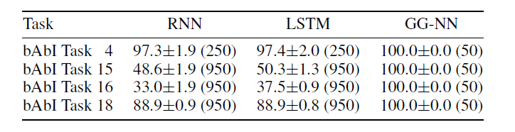
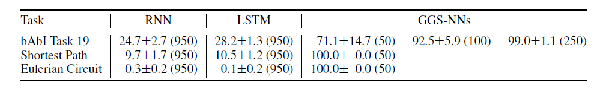
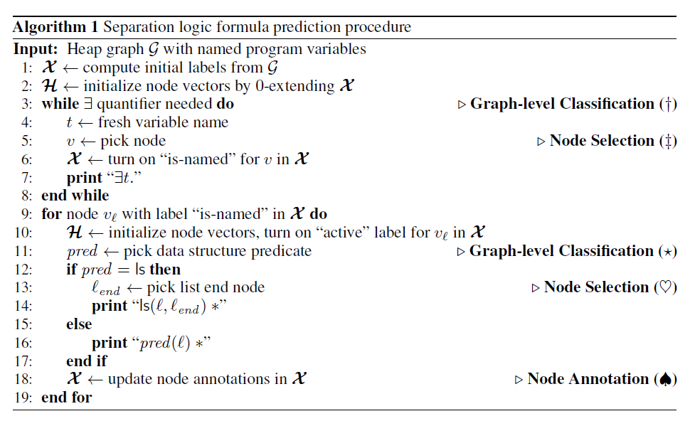
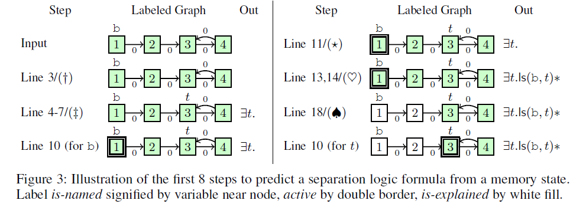
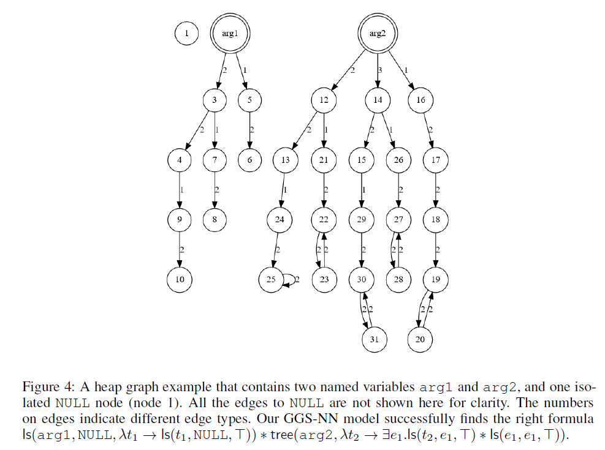
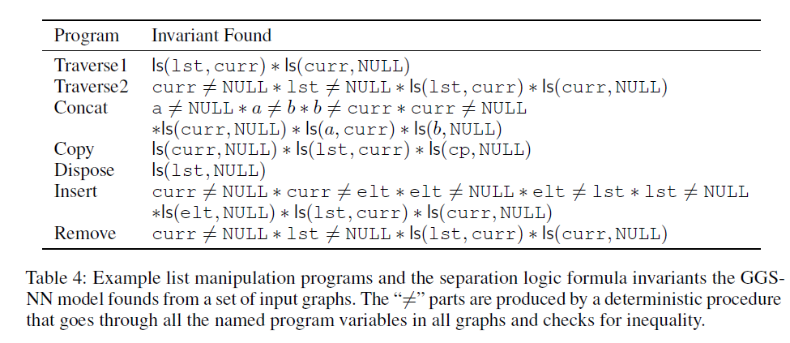

## 摘要
图结构广泛出现在化学、自然语言语义、社交网络和知识结构中。
在这篇工作中，我们学习了关于图结构输入的特征学习方法。
我们开始的起点是2009年的GNN的工作，我们使用gated recurrent units和现代化优化手段，并且扩展到输出序列。
结果是灵活的并且广泛对于神经网络，结果相对于纯粹基于序列的模型具有很好的归纳偏差?，尤其是图结构的模型。(LSTM)
> https://zhuanlan.zhihu.com/p/38740843, 归纳偏差简单的理解就是模型的偏好是什么？
我们描述了模型在bAbI任务上的能力和图的算法学习任务。接下来，我们展示了程序验证中的问题的应用效果，其中子图可以抽象为数据结构

## 1. Introduction
很多现实的图结构任务。 我们想在学习任务中将图作为输入。标准的方法对于问题来说包括对于一个输入图的工程自定义特征， graph kernel.
方法用来定义图的特征通过在图上random walks， 更多的靠近我们目标的是先从图中进行学习特征中能包括GNN, spectral networks以及在图足迹分类，化学分子表示上的方法

我们的主要贡献在于关于GNN在输出sequences上的边线。之前在特征学习的工作主要集中在产生图的单个，但是很多关于图的许多问题需要输出熟悉怒。
例子包括在图上的路径，具有理想节点的枚举，以及图分类任务的序列。比如， a start and end node.
我们不确定现有的工作是否能够很好的解决这个问题
我们的动机来自于程序验证，需要输出logical formulas， 我们把它形式化为一个序列化输出问题。
第二个贡献是GNN是一个广阔的神经网络模型可以应用再现阶段的很多领域

这里有两种关于图的特征学习的设定：
1. 学习关于输入图的表示
2. 学习在产生序列输出的interal state的表示

其中，1主要在GNN的工作里面。我们对这个框架做了调整，比如使用modern practices 有关Recurrent Neural Networks. 2是我们期望从图结构问题中输出的，这不仅仅是individual classfication. 因此，这要的挑战就在于如何在图中学习特征，并且encode 已经产生的partial输出序列（比如path so far if outputting a path），以及还需要被产生的（the remaining path）。 
我们同时也展示了GNN framework can be adapted to these settings, 从而获得一个新的关于基于图的神经网络模型，GGS-NNs

我们阐述了这个模型在bAbI tasks和图算法，在学习模型的能力上。 然后我们展示关于程序验证的应用。 当需要试图验证内存安全是，一个核心的问题是如何发现关于程序中运用的关于数据结构的数学描述。 我们 phrased这个机器学习任务，在我们需要map from a set of input graphs, 代表运用的内存，用来获取关于是咧的数据结构的logical descripton. 另外有一篇论文依赖于大量的手写工程的特征，我们展示了可以使用GGS-NN来替代该系统。

## 2. Graph Neural Networks

在这段中，我们review GNNs, 并且介绍了整个过程用到的notation and conecpts

GNNs 是一个普遍的神经网络结构根据图来定义， G=(V, E), 其中v为Nodes, e为edges. 我们主要集中在directed graph上，所以(v, v')表示一个directed edge, 但是我们发现这个框架可以easily to adapyed to undirected graphs, see Scarselli et al.(2009). The node vector(node representation or node embedding) for node v 是$h_v$, 图也可以包含关于摸个节点的标签, edge labels
$h_S$中S是a set of nodes
$l_S$中S是a set of edges
$IN(v)$表示v节点的祖先
$OUT(v)$表示v节点的后继
$NBR(v)=IN(v) U OUT(V)$表示v的邻居
$Co(v)$ 所有经过顶点v的边

GNNs将graphs map到outputs通过两步：
1. propagation step计算每个节点的表示
2. $o_v = g(\mathbf{h}_v, l_v)$ 从node的表示和对应的labels中学习，来获取关于每个节点的一个输出。
在对于g的notation， 我们留下了关于参数的隐式的依赖，然后我们继续做这件事。
this system是differentiable from end-to-end, 所以所有参数都可以通过gradient-based optimization学习

### 2.1 Propagation Model
在这里是关于一个迭代过程传播节点的表示。初始化节点的表示$h_v$可以设置为arbitary values(任意的值)，然后node representation根据下面的节点表示进行更新，直到convergence.

$$h_v^{(t)} = f^*(l_v, l_{Co_{(v)}}, l_{NBR(v)}, h_{NBR(v)}^{(t-1)})$$
很多变量被提及，所以Scarselli建议decompsing函数f为一个关于每个对应的变得相加

$$f(l_v, l_{(v',v), l_{v'}, h_{v'}^{(t)}}) = A h_{v'}^{(t-1)}+b$$

### 2.2 Output Model and Learning
输出模型定义在每个节点上， g函数是可微的，可以maps到输出。 这仅仅是一个linear or neural network mapping. 
在这个模型中每个节点将获得一个最终的表示。 
如果是为了处理graph-level分类任务，他们的建议是使用一个dummy 'supper node, which is connected to all other nodes by a special type of edge."
学习过程 ALmeida-Pineda算法已经完成
然后基于梯度的计算直到收敛解决最终问题。
评价：
1. advantage: 不需要存储中间状态来计算梯度。
2. disadvantage: 参数必须首先的， 所以传播步骤是一个收缩map。这需要来确保收敛，因为它可能限制模型的表达能力。

鼓励使用一个关于1-norm的Jacobian作为惩罚项。
Appendix A是一个例子，给出了收缩银蛇的直觉难以在图中长时间传播信息

## 3. Gated Graph Neural Networks

我们提出了GG-NNs, 适用于non-sequential puputs. 
关于GNNs的最大调整是我们使用了Gated Recurrent Units，并且unroll(展开) 一个循环的重复的神经步，使用backpropagation 来计算梯度。
这需要更多的内存相比于GNN算法，但是不需要限制参数来确保收敛convergence. 我们同时扩展了隐藏层的表示和输出模型

### 3.1 Node Annatations
在GNNs中， 这里没有明显的点来初始化节点的表示因为收缩图map constraint来确保，者使得我们不需要与其他的节点label作为额外的输出。为了分辨这些节点用作输入和之前介绍的节点。 node annotations 并且使用向量x来denote这些表示。
为了产生他们怎么用，考一个简单的任务，训练图神经网络来预测接地那t如何到达节点s在一个给定的图上。在这个问题中有来哥哥问题相关的 节点，s 和t， [1,0] [0,1].
在可到达的例子中， 可简单来看春波模型如何来传播节点的annotation(注解)，使得它们的第一位变为1. 
output step classifier可以轻易地辨别nodel是如何从s到达t的通过查看安歇节点有非零的实体在前两维上
> 这个过程好像标签传播

### 3.2 Propagation Model 前向传播模型


MatrixA决定了节点在图的communicate中如何进行交流。 
稀疏的结构和参数在A中图图1所示。 
eq 1是初始化步骤，copy node annotions到隐藏层的第一位，并把剩余维度清零。
eq 2是在不同节点间通过出度和入度的边来春波参数，这些参数独立于边的种类和方向。
$a_v^{(t)}$
> ? 输入x是什么？是对应的邻接矩阵信息吗? 注意维度，这里是二维的

剩余的就是GRU的部分
https://zhuanlan.zhihu.com/p/32481747

https://zh.d2l.ai/chapter_recurrent-neural-networks/gru.html

$z_t$用于门控的更新， $r_t$用于门控的重置

$h^{(t-1)} = h^{(t-1)} . r$
> 理解，$H_t$是更新门， 最终结果是对上一时间步的隐藏层和当前时间步的候选隐藏状态$H_t$做组合
$Z_t * H_{t-1}$ 表示对上一层的遗忘，忘记上一层的某些东西
$(1-Z_t) * H_{t}$表示对当前候选隐藏层的状态进行记忆。
这里z是门控喜好， 门控信号越接近1表示记忆得越多，越接近0表示遗忘得越多？？
> 需要看乘法是怎么做的？

> 不要管z和r怎么看，都是有w的超参数，实际上就进行理解为z是用来学习分配更新的，r是用来产生中间隐藏候选状态的中间变量


结果表示GRU-like 前向传播步骤更有效果

### 3.3 Output Models
这里有one-step outputs，我们可以用来产生各种的情形。首先GG-NNs node selection任务为门戈节点的输出进行打分，并且因公softmax在node 分数上
> 意思是node selection其实它会中间输出表示，按理说维度应该和类别一样。
> 其实这里就是中间观察的结果

对于graph-level outputs,我们的定义如下


> 这里$\delta$使用的是soft attention机制? 来决定是否哪些节点与当前的tgraph-level任务相关。 i和j是神经网络。使用$h_v^{(T)}$和$x(v)$$作为input和ouputs的real-valued vectors.
tanh可以被替代
> 这里说的就是如何产生中间观察结果，记得之前有学习过一个模型！
> 不理解？
## 4. Gated Graph Sequence Neural Networks
在这里GGSNNs

对于k-th 输出步骤，我们描述了node annotations as $X^{(k)}$, 我们用了两个
GG-NNs $F_o^k$和$F_x^k$来从$X$中预测o. 以及$F_X$用来从$X_k$预测$X_{k+1}$, 两个都是包括了一个前向模型和输出模型。在前向模型中，我们使用了节点向量作为t层的前向步骤和k层的输出步骤。
在之前的每一步，我们设置
> 这两个模型一个输出x， 一个用来输出o； 在之前我们把$H^{k-1}$初始化为0-extending的$X_{k}$. 这种简单的变体是能够很快用来训练和评估的，在很多case种，整个模型可以达到相同的表现。但是在某些case中，两个的表现效果不一样，所以这种变体不能work得很好
> ? 为什么
我们介绍了node annotation ouput用来从H预测X。
这个预测对于每个节点都可以很简单地用一个神经网络j来连接h和x作为输入和输出，从而得到一个真实的分数
> ?

这里有两种关于GGS-NNs的设定：
specifying all intermediate annotation Xk, 或者训练所有模型，仅仅给X1, graphs and target sequence.
前者可以提高表现力，但我们有邻居只是在知道节点的信息在哪些
> 取得节点达摩鞋特征。 
第二种更为普遍

1. Sequence outputs with observed annotations
考虑任务来做整个， 图的序列预测，每个预测只是包括图的一笑部分。为了确定每个部分都有一个输出，每个节点只有一位就过来，表示我们已经解释了。
> 子图训练？？

在某些设定中，少量的annotations足够来预测。我们可以扩展多个模型，这些模型都有注释地可做
> one idea, 可以用不同的邻域，来结合多个相同模型！！！ 还有模型的组合

单步domain预测，这实际上和所有是一样的
2. Sequence outputs with latent annotations
一般地，当中间不可用时，作为隐藏层，后向传播训练

## 5. Explanatory Applications

### 5.1 bAbI Tasks
这里我们简述了如何使用GGS-NNs. 我们主要集中在bAbI任务上。

bAbI tasks是Facebook提出的一个AI任务集， 第一组发布的bAbI包括20个任务。若要查看这些任务的详细信息， 请移步[bAbI tasks](https://arxiv.org/abs/1502.05698).  在bAbI数据集中，每一篇文本对应于一个故事。本文将每个故事映射成了一个简单的图（节点对应于实体，边对应于关系）。 每个问题(eval)由问题类型（类似于谓词，如"has_fear")与一些参数（对应于图中一个或多个节点）构成。当任务具有多种问题类型时，需要对每种类型都训练一个独立的模型。在本文中，仅处理类型未二元一阶谓词的问题。

例如，对于问题“eval E>A true”, 那么问题的类型为">", 图中的节点E将会被（初始化）标注为$x_E = [1, 0]^T$, 节点A将会被标注为$x_A=[0, 1]^T$, 其他节点将会被标注为$[0, 0]^T$

#### 单输出任务

单输出任务实验基于bAbI的四个任务： Task4: Two Argument Relations(选用D=4)； Task15: Basic Deduction(D=5); Task16: Basic Induction(D=6); Task 18: Size Reasoning(D=3)
> D是什么？

在bAbI任务集的四个任务上的实验结果为（括号内为使用的训练样本数，下同）



#### 序列输出任务

序列输出任务基于bAbI Task19: Path Finding(D=6). 其实验结果如下：



### 5.2 Learning Graph Algorithms

## 6 程序验证问题 GGS-NNs

在GGS-NNs的工作主要来自于实际program verification. 在automatic program verification中最关键的一步就是program invariants的推论， 它用来近似评估在一次execution中一些程序状态是否可达。 发现数据结构中的不变量是一个open problem. 在这里，C函数为例
```
node* concat(node* a, node* b) {
    if (a==NULL)  return b;
    node* cur=a;
    while (cur.next != NULL)
        cur = cur->next;
    cur->next = b;
    return a;
}
```
为了证明这个问题two lists a和b确实是concatnates连接的，所有指针取消引用都是合法的。我们需要characterize程序在每一次迭代的循环中的help。 在这里我们用了separation logic(分隔的逻辑符号)， 它使用inductive predicates归纳谓词来描述, 抽象数据结构。 举个例子， 一个分段的list定义为todo1,  todo2 意味着x指向一个内存区域，它包括了数据结构有两个域， val和next， 它们的值保存在v和n中， * connective是合并的布尔连接法， 但是额外需要它操作指导"separate" parts of the heap. ls(cur, NULL) 于是这cur要么是null,要么指向heap中的两个值v、n, 这里n用ls描述。 公式todo3 是一个循环的不变式。 使用它，我们可以证明，不会失败，因为不会引用一块未分配的内存地址。 这个函数进一步使用Hoare-style验证方式的确连接了两个lists.
关于整个流程最困难的地方在于产生描述数据结构的公式。在这里我们使用到机器学习。在给定的程序中，我们跑了很多次并且提炼了内存的状态（重新表示为graph)在相关程序位置，接着预测了分离逻辑公式。静态的程序分析工具可以检查一个候选的公式是否是充足地去证明它需要的属性。
> 这里考虑的是使用Machine Learning来描述data struture, 然后预测相关的separation logic formula??? 怎么能保证正确性啊？ 惊奇！！！

> Input这里边上的权重0表示什么意思？
### 6.1 Formalization

1. Representing heap state as a graph:  
作为输入，我们考虑有向图，可能是循环图来表示一个程序的heap. 这些图可以自动地构建程序的对状态。 每个图的节点都对应着内存中一块内存地址，在这块地址中，v0, ..., vk已经存储。 图的边反映了指针值，即v具有标记为0, ..., k 分别指向了节点v0, ..., vk
> ?? node 和 edge 还需要再理解。 实际上只指向一块地址，但是node可能多个地方对这块地址有引用？ 地址一块，一块链接存储，像链表一样，每个节点都对应独特的一块内存空间？
> 边的属性表示什么意思？

A subset of nodes are labeled as corresponding to program variables.

一个输入图的例子as "Input" in Fig.3. In it, 节点展示在节点里面。node id(i.e., memory address), 边的labels表示特殊的域？，e.g. 0对应于previous section中的下一个指针。 对于binary trees, 这里有两种类型的指针left, right分别指向树节点的left和right节点。
2. Output Representation 我们的目标是数学表示heap的形状。在我们的模型中，我们限制了分离限制的语法版， formulas的形式是，$\exists x_1, ..., x_n, a_1 * ... * a_m$， 这里每个atomic formula $a_i$或者ls(x, y), tree(x), 或者none(x)(no data struture at x). 存在量词是用于给描述形状所需的堆节点命名，而不给一个程序的变量命名。 举例， 为了描述“人手清单”（a list that ends in a cycle）, 第一个list element需要被描述。 在separation logic, 被表示为 $\exists t. ls(x, t) * ls(t, t)$

3. Data 我们为了这个问题产生合成的（标记的）数据集。自此，我们还修复了一些谓词，比如ls和tree(扩展名可以考虑双向链标的列表段，多树)以及它们的递归定义。然后，我们列举了实例化分离逻辑公式我们的谓词使用的程序变量集
> 程序变量集，变量v, address

最后，对于每个公式，我们列举满足该公式的堆图，结果是一个数据集包括我们heap graphs and associated formulas that are used by our learning procedures.

### 6.2 Formulation As GGS-NNs

通过数据迭代产生的过程来获得节点的中间表示。所以，我们训练一个不变量GGS-NN使用观察的annotations(observed at training time)
> 这里关注的点是什么？为什么要这么做

使用un-obeserved GGSNN variant来做end-to-end学。这个过程将会使得separation logic formula拆分为 a sequence of steps. 我们首先决定了来宣称了哪个必要的变量，如果可以的话，选择对应的节点来表示变量。`??` 一旦我们有了宣称的必要的变量，我们迭代所有变量的名字，然后产生一个separation logic formula以当前变量所对应的的节点未根来描述数据结构。
完整的算法如下所示。 

我们使用了三个明显的node annotation部分，namely is-named(heap node labeled by program variable or declared existentially quantified variable(量化的))， 被命名的， active(cf. algorithm) 和 is-explained(heap node is part of data struture already predicted). 初始化的节点标记可以直接从input graph中计算得到。 is-named是对于程序变量的编辑。 active和is-explained总是off. 

评论的行在扩展中都使用的是GG-NN。 Alg.1 是一个GGS-NN model的instance. 一个简要的关于算法运行的一开始的算法在Fig3, 每一个斗鱼算法的每一行相关


> Separation logic formula prediction procedure
```
Input:  Heap graph G with named program variables.
X: compute initial labels from G    // 做了些什么
H: initialize node vectors by 0-extending X

while exists quantifier needed do // 当需要存在量词的时候  Graph-level Classification
    t: fresh variable name
    v: pick node    // Node selection.
    X: turn on "is-named" for in X
    print "exists t"  // 不懂什么意思
end while

for node v_l with abel "is-named" in X do
    H: intialize node vectors, turn on "active" label for v_l in X
    pred: pick data structure predicate // Graph-level  Graph-level Classification 好抽象， 随便来抽取数据结构还是怎么会使
    if pred = ls then
        l_{end}: pick list end node  // Node selection
        print "ls(l, l_{end})  // 这里的print实际上就是输出上面想要分析的表达式
    else 
        print "pred(l)*"  // 没有tree等其他情况，等于说
    end if
    X: update node annoatations in X  // Node Annotation
end for
```
> 所以是这里每一步的评论都会用到GGS-NN模型？
> is-named, active, is-explained等于说是变量的三个状态， 于是heap中的变量的状态就是？，不过依然看不懂fig3



### 6.3 Model Setup Details
我么使用了full GGS-NN model， $F_o^k$ 和 $F_X^k$有着separate propagation models.
对于所有GG-NN成分，在GGS-NN pipeline中的， 我们展开传播过程为10 time steps. GGS-NNs与step(|)(决定是否更多存在两次变量需要声明)  和 step(||) (辨别哪些节点需要声明为存在量词)， 通过使用D=16维的节点表示。
对于all other GGS-NN成分， D=8使用，Adam优化器用来优化，模型被训练在20 graphs的minibatches， 优化直到训练错误率非常低。 对于图级别的分类任务，我们认为平衡地分类，每一小皮量中甚至都有even number of examples.
所有的GGS-NN成分包含了少于5k paras, 并且 no overfitting被观察到，在训练过程中。

### 6.4 Batch Predication Details
在实际中，一系哦啊部分heap graphs将会被给与input and a single output formula is expected to describe, 并且与所有的input graphs一直。 不同的heap graphs可以是程序执行过程中不同状态点， 或者运行在相同程序的不同输入。
我们称这个"batch prediction" setup 与描述在主要的paper中的single graph prediction相互对比。

为了得到batch predictions, 我们运行一次GGS-NN对于each graph同时的。 For each prediction step, 所有GGS-NNs的outputs at the step across the batch of graph被聚集。

对于node selection outputs, 普遍的命名为variables link nodes在不同的图上，它是聚集prediction in a batch的关键。我们计算particular named variable t as $o_t = \sum_g o^g_{V_g(t)}$, 其中$V_g(t)$maps 变量t到图中的一个节点。 $o^g_{V_g(t)}$是named variable t in graph g中的 output score. 当使用一个softmax对于所有names using $o_t$ as scores, 这个与计算$p(toselect=t)=II_g p_g(toselect=V_g(t))$相同。

对于graph-level 分类输出，我们增加一个特别的类的scores across the batch of graphs., 或者相等的计算$p(class=k)=II_gp_g(class=k)$, Node annoation outputs作为不同的图在每个图中独立地被更新，有着完全不同的set of nodes. 然后，当算法尝试更新annotation of one named variable, the node 相关联的所有节点也被更新。在训练中， 所有标记 intermediate steps对于我们是可获得的，从data generation process, 所以training process能够在一次的降解到single output single graph training.
一个更complex的情景允许nested（嵌套的）数据结构(list of lists)被讨论。 我们也成功地扩展了GGS-NN model到这个例子，更多的细节在Appendix C.

### 6.5 Experiments
在这篇文章中，我们产生了327 formulas的数据集，包含了三个程序变量， 498 graphs per formula, 产生了大约160,000 formula/heap graph combinations. 为了评估，我们分隔数据到训练集、验证集和测试集按6:2:2的比例(测试集不会用在训练集上)。我们测试了准确率，是否formula预测在测试时间在逻辑上等于基本事实
等价通过规范化来近似公式的名称和顺序，然后进行比较以求完全相等。

我么比较了我们的GGS-NN 模型和Brockschmidt中提到的方法。 更早的方法把每一个验证不都对待为一个标准的分类任务，并且要求complex, manual, problem-specific feature engineering, 来达到89.11%的准确率。作为对比，我们的新模型no feature engineering和少量的domain knowledge来达到了89.96%的准确率。

一个heap graph 的例子和对应的logic formula从我们GGS-NN model中发现的如fig4所示。

> 比较了两个命名变量arg1, arg2.  one isolated NULL node, nodel 1. 所有的边指向NULL没有进行显示。 边上的数字暗示了不同的边的类型。我们的GGS-NN模型成功地找到了正确的formul

这个例子还包括了nested data structures和the batching extension在之前的section中提到的。

我们还成功的用我们的模型在程序验证的framework, 提供所需将定理证明给定理证明这，以证明列表操作集合的正确性比如插入排序等算法。 一下table 4展示了一组基准列表操作程序和由GGS-NN模型找到的分离逻辑公式不等式，分别是在验证框架中成功使用以证明相应程序的正确性。


一个未来的扩展已经展示成功的证明了更复杂的程序比如排序程序，以及各种l其他list操作的程序。

## 7. 相关工作
最相关的工作是GNNs, 我们之前讨论过。 Micheli建议了另一个紧密相关的模型，它不同于GNNs，主要在输出上。 GNNs被应用在许多领域，但是他们没有广阔地在ICLR社区传播。我么的部分目的publicize GNNs是一个useful and interesting neural network variant.

一个比喻可以秒速我们从GNNs到GG-NNs的掉成， the work of Domke and Stoyanov在strutured prediction setting. 这里的信念传播（这里必须运行在能够convergence, 以取得好的梯度）被替代为truncated(截断的)信念传播更新。然后这个模型被训练，所以truncated iteration produce good results在一些迭代次数后。同样地，RNN扩展到了Tree LSTM也相似与我们使用GRU来更新GG-NNs而不是使用标准的GNN，目的在于提高长时间的信息在graph struture中的前向传播。
the general idea表现在paper中的是组装特定问题的神经网络学习成分已经有一个很长的历史，可以追溯到the work of Hinton， 用神经网络来根据家族数结构预测人与人之间的关系。
Graph kernel能够被用于一系列的kernel-based learning tasks使用graph-strutured inputs， 但是我们不知道learn the kernel 和outputs sequences. Perozzi转化graph为sequences通过following random walks在图上，学习node embedding 使用sequence-based的方法。
Sperduti map graphs to graph vectors 然后output neural network来分类这里有多种模型使用同样的节点表示的前向传播在图结构上。 他们的工作和GNNS的不同点在于卷积和recurrent networks.
Duvenaud认为convolutional想在图上的操作，建立一个可学习的，可微的关于graph feature的变体。 LUsci转换认为的无向图为一定数量的不同的DAGs，然后向内传播节点表示每个根，训练一组模型。在以上所有内容上，重点都放在了一步式问题上。

GNNs和我们扩展具有滋镇网络的许多相同的理想属性。使用节点选择输出层，可以选择输入中的及诶按作为输出。
有两个区别： 首先，在GNN中，图结构是显式的，这使得模型通用性较低，但可以提供更强的泛化能力；第二，指针网络要求每个节点都有属性（比如, 空间中的位置），而GNN可以表示已定义的节点仅通过他们在图形中的位置即可，这使它们在不同维度上更具有通用性。 
GGS-NN与软对齐和注意力名有关。有两个方面，第一，eg7中，等式的图形表示， 使用上下文将注意力集中在哪些节点对当前决策很重要；第二，节点程序验证例子中的注释跟踪已注释的哪些节点，因此，它地公馆一种明确的机制来确保输入中的每个节点都已经使用在产生输出的顺序上。

## 8. Discussion

1. What is being learned? 有启发的去思考GG-NNs能学到什么。为此，我们可以在bAbI任务的方式之间类比, bAbI task15将会通过logical formulation得到解决。作为一个例子，考虑右边的一个例子中需要回答的行。

为了做逻辑推断，我们需要的不仅仅是关于故事中事实的逻辑编码，而且，关于世界的背景知识也编码为一个inference rules

我们对任务的编码简化了将故事解析为图形形式的过程，但没有提供任何背景知识，可以将GG-NN模型视为学习此方法的结果存储在神经网络权重中。

2. Discussion  论文的结果表明，GGS-NN在整个过程中都具有理想的感应偏差，一系列具有固有图结构的问题，我们相信在很多问题，在更多情况下，GGS-NN将很有用。但是，有一些限制需要克服这些障碍，使其广泛地应用。我们前面提到的两个显示是bAbI任务翻译未包含输入的时间顺序或三进制或更高解关系。我们可以想象一下接触这些限制的可能性，例如将一个座位会议论文在ICLR2016上发布的一系列GG-NN, 每个边缘有一个GG-NN, 代表更高阶的关系，作为因子图。一个更大的挑战是如何处理结构化的输入表示形式。例如，在bAbI任务中，最好不要使用输入的符号形式。
一种可能的方法是在我们的GGS-NN中合并结构较少的输入和潜在向量。但是，需要进行实验以找到解决这些问题的最佳方法
## Analysis

相比于传统的图数据处理方式，GNN、 GG-NN、GGS-NN等模型可以有效地利用图的拓扑结构信息，这也是为什么GGS-NN可以在Path Finding任务中取得优异效果的原因。另外，由于这些模型在每个实践部都需要展开所有的节点，因而这些模型也可以用于处理各种图（包括有向图、无向图、有环图、无环图等）。但是，这同样也带来了一些问题：
1. 由于在每个实践部都需要展开所有的节点，每个节点还需要使用D维向量进行表示；当图很大且向量表示很大时，模型的效率问题就会变得很重要
2. 在GNN中需要保证凸的整体映射是一个压缩映射，这显然就减小了该模型所能建模的问题空间???(好像的要求时对于寻找压缩映射问题而言的)。为了解决这一问题，GG-NN将传播时间步固定为T, 虽然不需要保证收敛，但是，图上的信息传输却也因此受到了约束(???，信息的传输与时间步有关，因为终止条件不再是收敛，而是具体的时间步)。例如，在可达性预测任务中，在两个时间步后节点1的信息才可以到达节点4.虽然本文中采取了一定的措施来缓解这一问题（即不仅定义了沿边方向的转移举证，还定义了与边相反方向的转移矩阵）。但是只要T的大小有限，节点之间的信息就只能沿着路径传播T步，而不能像GNN那样到模型收敛才停止。换句话说，GG-NN实际上是以损失图中较长路径信息的代价换取了模型可建模的问题空间。

## code

th test.lua to test all the modules in the ggnn and run libraries

1. go into "babi/data", run'bash get_10_fold_data.sh" to get 10 folds of bAbI data for 5 tasks (4, 15, 16, 18, 19) and do some preprocessing
2. go into 'babi/data/extra_seq_tasks', run'bash generate_10_fold_data.sh' to get 10 folds of data for the two extra sequence tasks
3. go back to 'babi/' and use 'run_experiments.py' to run the GGNN/GGS-NN
4. Use 'run_rnn_baselines.py babi18 lstm' runs LSTM on bAbI task 18 for all 10 folds of data


## 参考文献

https://zhuanlan.zhihu.com/p/28170197

jianshu.com/p/40362662014a
