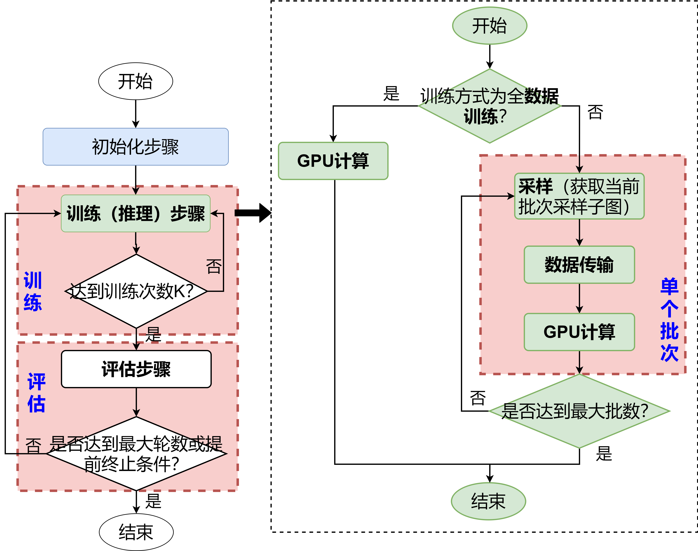
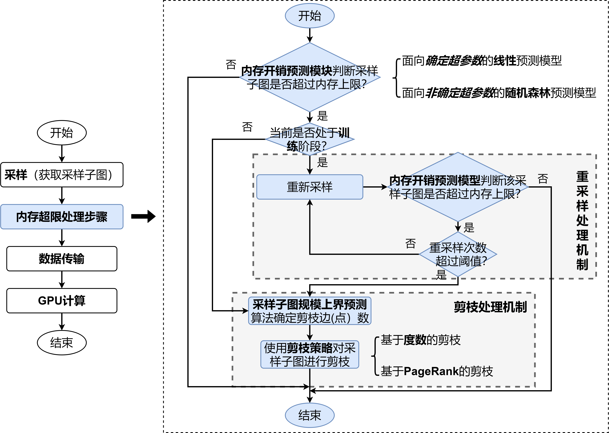

今天被批评了，这些都是由我自己造成的。

很多时候感到自己孤单，但是一细想是能体会到身边人对我的关心的。

> 先回复师兄吧

昨天预答辩表现太差，实属自作自受。一下子浪过了头，PPT也没有做好，

## PPT大纲
新的PPT的计划:(15分钟)

### 标题 + 目录 (30s) (2页)

### 第一章 研究背景及相关工作（2min) (7页)
1.1 研究背景
P1: 
- 图神经网络作为一种基于深度学习处理图数据的方法，广泛应用与多个领域
- 现实应用中图数据规模迅速增长，图神经网络结构日益增长，但GPU内存受限。许多图神经网络系统和采样技术相继提出。
- 本文重点关注于从系统角度的基于GPU的大规模图神经网络的计算性能优化。

1.2 相关工作（待进一步完善）
P2: （1）图神经网络算法
现有图神经网路算法众多，但对基于GPU的大规模图神经网络的计算性能的关注工作却有限。
这些算法主要集中在精度，并且都是case by case
P3: （2）图神经网络性能评估
效率方面工作集中于发现
P4:（3）图神经网络系统
目前系统包含了单机环境、分布式环境的系统。
从xx, xxx, xx角度可以将这些系统划分为
1
2
3
这些系统没有关注到提高采样流程的效率和采样流程的安全性。
P5:（4）采样方法
采样方法专注于采样本身的效率，以及如何提升精度。
这些采样方法为考虑。

1.3 工作概述
P6:
（1）针对性能瓶颈分析工作缺乏的问题，本文对图神经网络计算性能进行了系统的分析。
    - 选择了四个代表性算法，对采样技术引入前后的图神经网络的性能瓶颈进行了研究。
（2）针对训练推理过程低效的问题，研究提出了基于流水线并行的图神经网络训练推理流程优化方法。
    - 采样流程的流水线并行优化有效解决了采样过程额外开销大的问题。
    - 训练与评估步骤的流水线并行优化有效解决了评估步骤耗时长的问题。
    - 实验结果表明，该优化方法可以有效加速训练与推理过程。
（3）针对内存开销波动以及个别批次可能出现内存溢出风险的问题，研究提出了内存使用可控的图神经网络训练推理流程优化方法。
    - 利用面向确定超参数的线性模型和面向非确定超参数的随机森林，对给定采样子图上的内存开销进行预测。
    - 采样基于度数和PageRank的超限子图剪枝策略缩减子图规模，确保内存开销小于GPU内存容量上限。
    - 实验结果表明，线性内存开销预测模型准确率达99%以上，随机森林预测准确率高达95%，超限子图剪枝策略能有效限制采样子图的内存开销，且对模型精度的影响低于随机剪枝策略。

### 第二章: 基于GPU的图神经网络计算性能瓶颈 3min (11页)
2.1 实验说明
（1）实验算法
P1: 对于图神经网络来说，主要可以分为三个步骤：a.聚集; b.更新。聚集操作与领边相关，更新操作与点相关。根据复杂度分析，本文将主流的算法划分在四个象限。选取各个象限的GCN,GGNN,GAT,GaAN作为代表性算法
（2）实验设置
P2: 如图所示，实验数据集和实验设置
- 数据集：精度评估中最常用的数据集
- 选取了两种代表性的采样方法。
（略去参数设置）
2.2 图神经网络的性能瓶颈？
P3: 时间方面
图神经网络层：在大多数情况下，边计算都是主要性能瓶颈。
边计算层：边计算的性能瓶颈在消息步骤，同时聚集和收集步骤也非常重要。

P4: 内存方面
PyTorch本身产生用于后向传播的被缓存的内存产生了高额的膨胀比例，导致了内存很难扩展到。

总结：图神经网络计算的性能瓶颈在边计算时期。
但是，图神经网络存在高额的内存使用，制约了数据扩展性。

2.3 采样对性能的影响

P5: 为了解决GPU内存有限下，大规模图神经网络的训练，采样技术提出。采样技术从大图中采样出小图，来进行图神经网络。相比于全图训练方式，采样技术以分批方式，即一轮训练中将大图拆分为多个小图进行一个批次训练。
采样是基于CPU的，一次参数更新中加入了采样过程和数据传输的耗时。
如图所示，可以发现，与全数据方式相比，明显内存更低。

此外，由于评估部分，需要基于全图评估，发现相比于全图评估。
训练耗时 -> 采样耗时 

P6: 采样对精度的影响。

P7: 如图所示，对采样过程BreakDown分析。目前，采样过程的采样和数据传输占据了大部分的耗时。

P8: 采样引入了随机性。如图所示，。推理同样如此。

2.4 总结
P9: 
图神经网络计算的性能瓶颈在边计算时期。边计算复杂度高时，重点在消息时期。同时，收集和聚集也值得优化。
GPU内存有限下，由于高内存使用，采样技术是大规模的必要手段。采样并不会带来精度的下降。但采样存在两大性能问题：

1. 训练推理流程低效问题。训练流程中存在评估步骤耗时大，采样过程存在采样和数据传输额外开销大。

2. 内存有限下的内存安全问题。内存波动大从而某些个别批次可能触发内存安全问题。

### 第四章: 基于流水线并行的图神经网络训练推理流程优化。5min (13页)；4/9=1/2
> 可思考这里是否需要引入问题背景

P1: 4.1 总设计流程（通用化流程）

P2&P3: 4.2 采样过程的流水线并行优化

P4&P5: 4.3 训练和评估步骤的流水线并行优化

4.4 实验结果分析（实验数据集与第三章一致）
P6: 实验说明
> 思考是否需要加入 

P7: 采样过程优化
> 算法、数据集和批规模的影响

P8: 训练与评估步骤优化
> 算法、数据集和训练轮数的影响

P9: 叠加优化结果
> 用来查看哪种优化效果更佳？

### 第五章: 内存使用可控的图神经网络训练推理流程优化 5min (17页) 1/4, 5页;  8/14=1/2
> 思考问题背景是否引入问题背景

P1: 5.1 总体流程设计 

5.2 内存开销预测模型
P2:（1）面向确定超参数的线性预测模型

P3:（2）面向非确定超参数的随机森林预测模型

P4:（3）内存开销预测模型的训练与在线更新

P5: 5.3 采样子图规模上界预测方法。

（1）确定删边
（2）确定使用二分法

5.4 采样子图的剪枝策略

P6：剪枝策略的工作流程（流程图）

P7：边重要性的衡量方法

5.5 性能评估
P8: 实验说明（内存开销预测模型评估指标）
（1）内存开销预测模型
a. 准确率
P9:线性内存开销预测模型
R2准确率均在0.99以上。
P10: 随机森林模型。
R2准确率均在0.95以上。
b. 额外开销

（2）重采样策略评估
P11: 
> 耗时这里就是重采样一次的耗时

（3）剪枝策略评估
a. 准确率
P12: 不同算法下准确率
P13: 内存受限下对准确率的影响
b. 额外开销
P14: 虽然很耗时，但是剪枝发生比例非常小，所以额外开销有限。

>（4）总的额外开销
> 总的额外开销由内存开销预测模型 + 重采样处理机制 + 可能的剪枝处理。

### 第六章 总结与展望 1min （2页）

P1: 本文工作总结

P2: 未来工作

### 附录 (5页)

P1: 研究生期间工作

P2: 致谢

P3&P4: 参考文献

P5: 谢谢