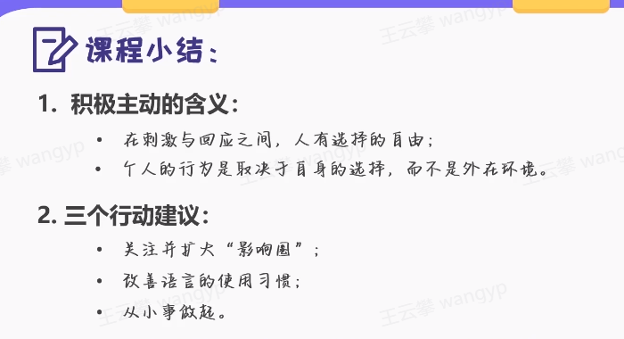

https://elearning.kundou.cn/student/course-content/5fc9b77e5ebfdb9c5c6a6bf2?entrance=course_list&lesson=yFQ2eUbYM

## 1. 高效能人士的习惯概述

如何使自己变成高效能人士？

第一步，转变思维方式。培养以原则为中心的思维方式。原则是不能动摇的自然法则，如公平、正义、诚信等。有了它就可以培养高效能的习惯。

第二步，培养以下六个习惯。
个人领域：
1 积极主动
2 以终为始。
3 要事第一。

公众领域：
4 双赢思维
5 知彼解己
6 综合统效

总的方面
7 不断更新

## 2. 积极主动

在刺激与回应之间，人有选择的自由

积极主动的含义：
第一，采取积极的态度与行动，面向现实和面向未来
第二，个人的行为是取决于自身选择，而不是外在环境

日常语言：
我可以xxx
我能选择xxx
我选择xxx
我愿意xxx

每个人有自己的关注点，按照是否可以掌控可以分为：
一，影响圈
如何提高自己的影响力
二，关注圈

如何做到积极主动？
1 专注并扩大“影响圈”
- 可直接控制的问题：与自身行为相关，培养正确习惯
- 可间接控制的问题：与他人行为相关，改进影响方法
- 无法控制的问题：与经历&环境有关，改变心态
2 改善语言的使用习惯
3 从小事做起：以28天为一个周期，确立具体的flag

## 3. 以终为始

纠结与各个问题，并且懊悔为什么没有想清楚

含义：
- 以目标为导向，从结果出发（反向思维方式）
- 以原则和价值观为基础，走对方向，走好方向

如何培养
1. 明确个人准则
    - 基于个人的愿景和价值观——个人宪法
    - 因人而异
2. 区分角色
    - 排好每个角色的重要性
    - 为每个角色设定好目标（三条行为要求）
    > 如生活：朋友，女儿，摄影师；工作：销售，小白
3. SMART法则，对每个目标进行分解，明确目标
    - S(Specific): 具体的，明确的
    - M(Mesuable): 可衡量的
        > 能量化的量化，不能量化的细化，不能细化的流程化；数量、质量、成本、时间、满意度五个维度衡量
    - A(Attainable): 可实现的
    - R(Relevant): 相关性的
    - T(Time-based): 有时限的

## 4 要事第一

经常感觉时间不够用？重要的事情好像一件也没干好？

时间管理，本质是自我管理

“要事”的特征
1. 与目标有关
工作中，与关键OKR有关
生活中，与人生目标有关
2. 具有价值：附加价值和长远价值
3. 因人而异：个人角色与原则

“时间管理四象限法则”
1. 危机：重要且紧急
    - 消耗大量时间和精力，持续性感到压力，成为消防员
    - 不要拖延、提高效率、做好第二象限的工作（减少第一象限事情的发生）
2. 要事：重要且不紧急（七个习惯）
    - 制定预防性措施
    - 团队梯度培养
    - 锻炼身体
    - 学习英语
    - 复盘
3. 琐事：不重要且紧急
    - TODO List
    - 勇于说no，分清主次
4. 杂事,消遣：不重要且不紧急
    - 整理办公桌，娱乐
    - 请勿沉迷

如何坚持做“要事”？
- 提高要事的优先级（优先将要事安排在日程表中）
- 留出整块时间集中做
- 按计划逐步推进（不需要非常精细）
    - 将要事拆分小目标，逐步推进
    - 留出弹性时间
    - 摆正心态，不要急躁

## 5 双赢思维

含义？
双赢!=妥协让步
在双方均认可下，达到均获利的方式

人际交往的六种模式：
- 赢/输 （损人利己）
- 输/赢 （舍己为人）
- 赢 （独善其身）
- 输/输（两败俱伤）
- 赢/赢（利人利己）
- 无交易（好聚好散）

重要性：
- 是在相互依赖的环境中唯一可行的交往模式
- 是在敢作敢为与善解人意之间的平衡状态

如何培养？
1. 向情感账户存款
    - 理解他人
    - 注意小节
    - 信守承诺
    - 明确目标和期望
    - 正直诚信
    - 勇于道歉
    - 无条件的关爱
    > 针对不同的人，存取款行为各不相同，不要试图速战速决；
    > 存款:
    > 取款：
2. 识别立场，预设善意；提高ROI
    > 不要纠结与立场，不指责不评价，以解决问题为目的
3. 无法双赢，不如好聚好散

## 6 知彼解己

先理解对方，再正确对方理解自己
倾听 + 表达

自传式倾听 vs 移情倾听 ?
- 自传式倾听: 以自我为中心；把让别人理解自己放在首位；用自己的经历理解别人
沟通状态：频繁打断，没有眼神和肢体的交流，记不住讲述内容
表现：评价（对或不对），探究（还有其他原因），建议（好为人事），诠释（肯定是因为xx原因）

- 移情倾听：以理解对方为目的；把先理解对方放在首位；在情感和理智上充分理解对方
沟通状态：鼓励讲话者叙述更多，眼神、表情和肢体都有互动，能记住讲述的重点

步骤：
第一步，全神贯注的听。以眼神、手势和语气词配合即可。对方与你讲述内容在7:3或8:2以上。
第二步，表现出兴趣，引导对方继续讲述。对方在期待你的回应。还有呢，还有哪些呢，再多跟我说说等等
第三步，扼要总结复述，捕捉确定关键词。复述时不掺入过多的个人情感。最主要关注的是哪一点呢？
第四步，聚焦关注点，引导更深层次的沟通。你关注A是有哪些原因呢？

注意：
1. 节奏慢下来
2. 注意语音、语调和肢体动作
3. 把理解对方放在首位

知彼解己是实现有效人际沟通的关键

## 6 统合综效

含义
- 整体大于部分之和
- 各部分之间的“关系”也是整体的一部分
- 有差异才有收获

前提条件：
- 余额充足的情感账户；
- 双赢模式；
- 先理解他人。

区别：
- 有开放的心态
- 充满正能量
- 以不同的视角看世界
- 寻求理解他人
- 积极寻找第三条道路

根本原则：尊重差异、取长补短
1. 了解你与他人的差异
    第一步，写下他的特质
    - 才智/能力
    - 成长环境&教育背景
    - 人际关系能力
    - 性格特征
    第二步，写下你与TA的显著差别
    第三步，写下这些差异可以怎样帮助你们实现共同的目标
2. 坦诚开放，尊重差异（珍视、肯定）
3. 设定共同目标

## 7 不断更新

提高个人产能，保护并优化自己

- 兼顾人生的四个层面：身体、精神、智力、社会/情感

第一步，身体
第二步，精神（非常私人，因人而异），冥想，亲近大自然，找良师益友沟通，回忆小时候
第三步，智力（自我教育）。定期阅读优秀著作，写作
第三步，社会/情感（时刻自我激励，不断训练和累计）

如何做？
1. 低调开始：从小事+有吸引力的事情做起
2. 留出空闲时间，不要急于求成
3. 不断调整

学习，坚持，实践
（坚持原则）